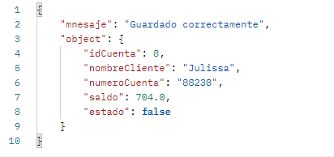

# Construcción de api rest utilizando java (spring boot), maven y MySQL

Esta API proporciona operaciones fundamentales que permiten consultar, crear, modificar y eliminar cuentas.

## Instalación

#### Requisitos previos
-Java
-MySQL
-Maven
-Postman

## Crear el proyecto con Spring Initializr
-Ve a Spring Initializr para generar un proyecto Spring Boot.
-Selecciona las dependencias necesarias
-Descarga y extrae el proyecto ZIP generado

## Configuración de la base de datos
Edita el archivo application.properties con tus credenciales de MySQL

## Carpetas del proyecto
#### controller: Contiene los controladores que manejan las solicitudes HTTP y las respuestas.
#### model: Contiene los modelos de datos (dao, dto, entidad y payload).
#### service: Contiene la lógica de negocio, dividida en interfaces y su implementación

## Uso de la API (solicitud y respuesta)

1. Mostrar cuentas
   GET http://localhost:8080/api/v1/accounts

2. Crear una nueva cuenta
   POST http://localhost:8080/api/v1/accounts

3. Actualizar una cuenta
   PUT http://localhost:8080/api/v1/accounts/7

   

4. Desactivar una cuenta
   DELETE http://localhost:8080/api/v1/accounts/{id}

